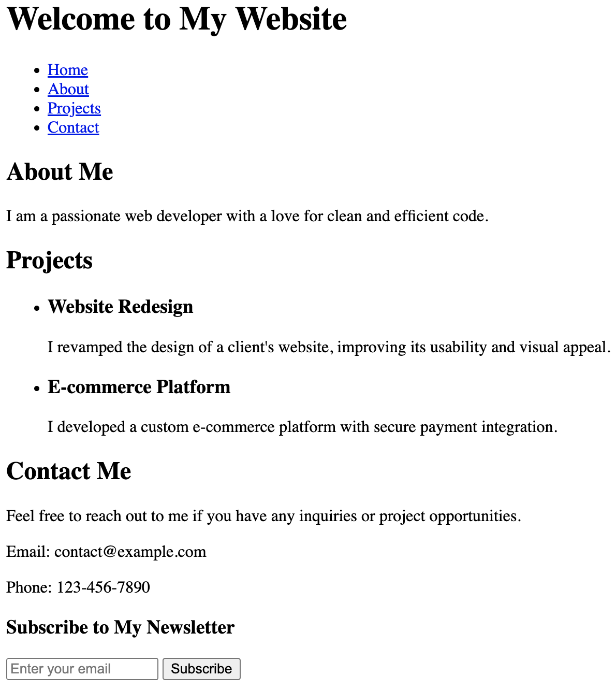
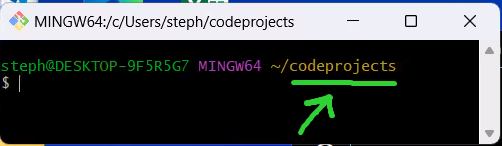
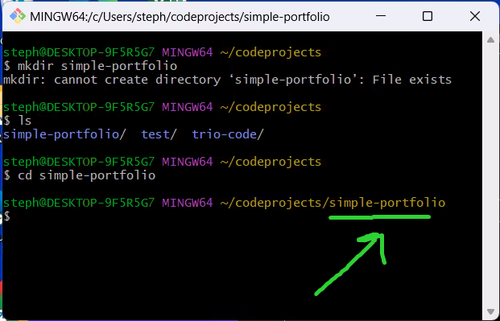

# Review

Common Commands on the Command Line Interface (Git Bash or Terminal)

- cd (change directory)
- ls (list)
- mkdir (make directory)
- rmdir (remove directory)
- touch (create a file)
- clear (clears the command lines)

# Introduction

Using HTML we will build a first edition of something every person who codes will make at least once in their coding career, a portfolio!

What is HTML anyways? Well, HTML stands for Hypertext Markup Language, which is one of the most basic building blocks of the world wide web. "Hypertext" refers to the links that connect web pages to one another. "Markup" refers to the way we mark content to ensure it is visually digestable and not just a bunch of words on a blank paper. Finally, "Language" is just a reference to the form of communication, coding is speaking the language that computers understand.

So how does it work?

That's a bit more fun. Earlier we refered to HTML as the "building blocks" and that is a very accurate description. HTML consists of multiple parts that build the web pages we see everyday:

- text
- images
- logos
- links
- elements, and more

Let's take this html cole and web page for example. We have header "Welcome to My Website", main section "About Me, Projects, and Contact Me", and footer "Subscribe to My Newsletter".

   

Some Common HTML Elements: (Useful list for one of our activities today)

1. head - contains the data that the computer reads like the title of the page, where to find the files for the styling, and much more
2. title - contains the data that the browser will show in the tab as the title of the web page
3. body - contains the bones of the web page, it will contain all of the data shown and displayed on the web page
4. header - usually contains important static information such as a logo and some navigation to the different pages on a web site
5. footer - usually contains the copyright information as well as a sitemap if used
6. p - short for paragraph, is used to contain text and is just one of many ways to display various text
7. div - just a container, used for grouping items together such as cards for blogs
8. button - used for interaction with the user, mostly found in forms and navigation
9. nav - short for navigation - this usually contains all the links for the web site navigation
10. ul - short for unordered list - used to organize a list of items in no specific order, there's also organized lists (ol) and they're both made up of list items (li)

Now that we've looked at the theoretical, we will put that into practice.

# Instructions:

Let's talk about the portfolio for a minute, there are a few things that are required for this web page. You need to include:

- Name
- Job
- About You
- Projects (Samples of Your Portfolio)
- Contact Me

Feel free to keep the information basic. If you don't know what to put for your About section then try a few of the following prompts:

1. List of favorites (places, food, animals, etc.)
2. What drew you to learn code?
3. A goal project, a web page or concept you would like to build out yourself.

## Step 1. Write out some responses:

Take the above list of required items and mark down your responses to each item, either on paper or via your computer.

## Step 2. Make a new folder in your projects folder (in Gitbash/Terminal):

1. Open your terminal, and navigate to your "code-projects" folder.
   Your command line should look like this.

   

2. Create your new project folder "mkdir simple-portfolio"

3. Change directories into that folder.

Your command line should look like this.

   

4. Create a index.html file by typing in "touch index.html"
   (Note: The index.html file is often the starting point of an app or webpage. It contains the structure, content, and layout of the web page using HTML tags.)

5. Open VS Code from your terminal by typing "code ." which will automatically open VS Code with this file ready for editing.

## Step 3. Enter your information:

1. In VS Code, open the "index.html" file
2. Just as before, type an exclaimation point "!" and press enter. This will give you the HTML Scaffolding, the basics of a HTML web page
3. Between the "<body>" tags for the body element, make a few new lines and type out your responses to the portfolio prompts.

# Activity: Add HTML Elements

HTML elements (as displayed in the list from the beginning of class) allow you to structure and present content on a web page. Don't worry about the styling here as much as using and experimenting with different elements, how to use them, and what they produce.

Instructions:

## Goal: Add to your page at least one of the following elements.

- `
</div`>
- `<header></header>`
- `

`
- `<h1></h1>`
- `<h2></h2>`
- `<h3></h3>`
- `<footer></footer>`

## Stretch Goal: Add to your page an image tag element

- Please note, image tags are different from other tags.
- Other tags have an opening tag and closing tag, such as `
Hello World
`
- Image tags are self-closing meaning there is only one combined tag, such as ``

## Grading Criteria:

- Does Not Meet Expectations: Incomplete work, not all criteria are met
- Exceed Expecations: Meets the goal & stretch goal
- Meets Expectations: Takes the project features beyond the stretch goal (adds CSS or JavaScript), Helps other students learn and succeed

## Deeper Dive:

Look at some portfolios you like and try to figure out what kinds of elements they're using.

- www.careerplantoday.com
- www.cloudexam.org

Again, you can visit [this web page](https://developer.mozilla.org/en-US/docs/Web/HTML/Element) by MDN Web Docs to see a full list of HTML elements and their uses.

## Next Steps:

Now that you've experimented with the basics, it's time to push your understanding. Pick three websites, keep them basic, and write out what elements you think they used on their home page. When you think you've identified the elements. Open the inspector in your browser by right clicking the page, scrolling towards the bottom of the menu that pops up, and clicking "Inspect" which will open up your browser's console. Click "Elements" across the top of the console that pops up and you should be able to see the code as it's displayed in HTML.

# Recap

Common Commands on the Command Line Interface (Git Bash or Terminal)

- cd (change directory)
- ls (list)
- mkdir (make directory)
- rmdir (remove directory)
- touch (create a file)
- clear (clears the command lines)

HTML

- HTML, which stands for HyperText Markup Language, is the standard markup language used for creating and structuring the content of web pages.
- <head> element contains meta-information about the webpage, such as the title displayed in the browser's title bar.
- The <body> element contains the visible content of the webpage.
- HTML elements are the building blocks of an HTML document. They define the structure and content of a webpage.
- HTML elements include things such as: `
`, `
`, `<a>`, ``, `<ul>`, `<ol>`, `<li>`, `<table>`, `<tr>`, `<td>`, `<form>`, `<input>`, `<button>`, and more
