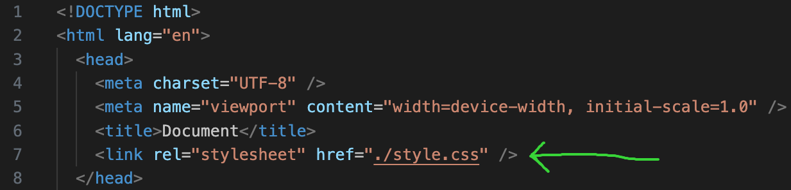

# Review

We're going over a good deal of terminology so let us review some of what we've learned so far:

**Common HTML Tags/Elements**

- head: contains metadata
- body: contains the content that users will see on the web page
- header: contains important static information such as a logo and navigation
- main: Contains the main content of the webpage.
- footer: Appears at the bottom, often used for copyright, social media links, and other information.
- p: contains and displays text
- div: just a container used for grouping items together
- nav: contains the links for the web site navigation
- ol/ul: contains list items, ordered or unordered

**Common Commands on the Command Line Interface (Git Bash or Terminal)**

- cd: command to change directory
- ls: command to list out items in current directory
- mkdir: command to create directory
- rmdir: command to delete directory
- touch: command to create a file
- clear: command to clear the terminal

# Introduction:

We will learn CSS styling with a hands-on activity. CSS stands for Cascading Style Sheets. It is used to define the appearance and formatting of HTML elements on a webpage, such as colors, fonts, layout, and positioning.

# Instructions:

We will revisit your Portfolio project and updating it with CSS.

## Step One: Create a Style Sheet

1. Open your terminal, and navigate to your "simple-portfolio" directory
2. Type into your terminal "touch style.css" to create your new style sheet
3. Type into your terminal "code ." to open your code in VS Code

## Step Two: Link your Style Sheet

1. Open your "index.html" file
2. Above the closing `head` tag insert a link to your style sheet

   > `<link rel="stylesheet" href="./style.css" />`

   

## Step Three: Make some changes

1. Change your name to an `h1` element, change the color of the text, and the size
2. Change your job to a `span` element, make the text bold
3. Put your "About Me" section into a `div`, put your about me section as well as your image inside of this div, style with at least 2 changed properties for this section
4. Change the background of your web page

## Goal:

Add styling to your page with at least an `h1`, `span`, and `div` elements, making changes to their styling including but not limited to color, size, position, and location of items on the page.

## Stretch Goal:

## Grading Criteria:

- Does Not Meet Expectations: Incomplete work, not all criteria are met
- Exceed Expecations: Meets the goal & stretch goal
- Meets Expectations: Takes the project features beyond the stretch goal, Helps other students learn and succeed

## Activity Debrief:

CSS usually exists in its own file, commonly named "style.css". This helps keep the logical code and the style code clean for easier reading. Howevever, that means the HTML will need to connect to the CSS in the head of the HTML file with something like this:

> `<link rel="stylesheet" href="./style.css />`

What does that say?

- **link:** tells you that it's a link to another document
- **rel:** stands for relationship and tells you what the new document has to do with the current document. It clearly states this is a style sheet informing the html document that there will be additional styling.
- **href:** stands for hypertext reference and specifices the location of the new document.

Great so it's linked, and now it knows how to read whats in that document, but how do we? CSS is written pretty specifically, and can be read as a set of instructions. First you list the element you'd like to make changes to, then you give a set of commands for those changes. It'll look something like this:

```
selector {
  property: value;
  property: value;
}

```

Or to use that `h1` example from earlier:

```

h1 {
 color: red;
 text-align: center;
}
```

The basic outline is that you use a **selector** to specify which element you'd like to be changed, then you start a **declaration** with a pair of curly brackets `{}`. Inside the curly brackets will be a list of **properties** of that element, and the **property value** you want to change that property to. **Selectors** can be made up of tags, but it can also be more specific such as a class, which is an attribute of an HTML tag that helps group tags together. Or maybe you want to change what happens when someone hovers over an item like a link, that's actually a pseudo-class and is written like: `a:hover`. Every element has a list of properties that you can change with CSS, and common values that you can change those properties to. [Here is a list](https://www.w3schools.com/cssref/css_default_values.php) of the CSS default properties and values for HTML elements. This should help you see where you can start with minor changes.

## Deeper Dive:

## Next Steps:

# Recap
