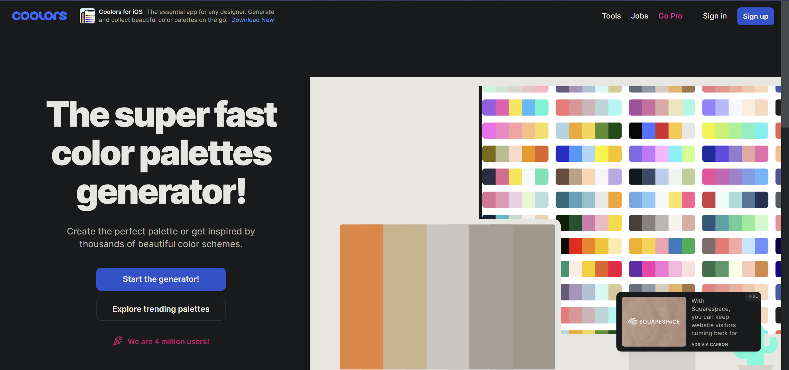
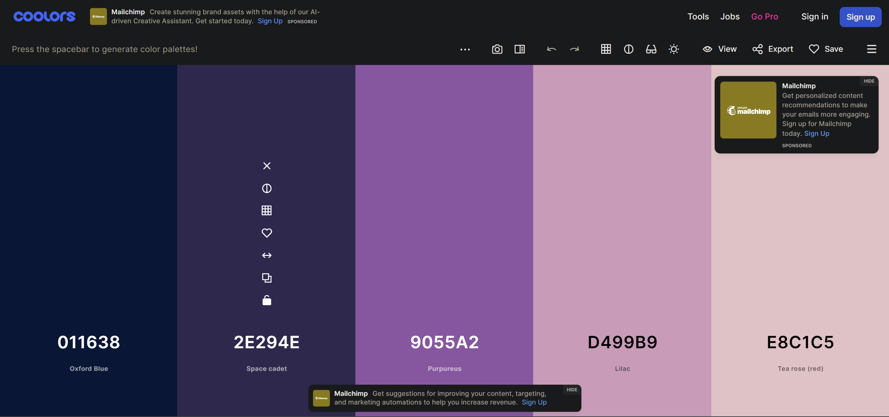
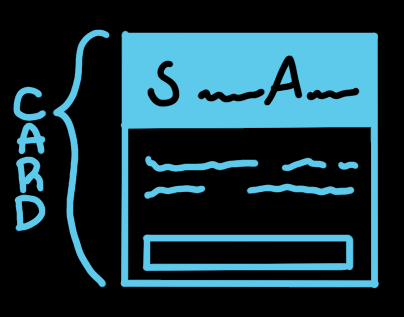
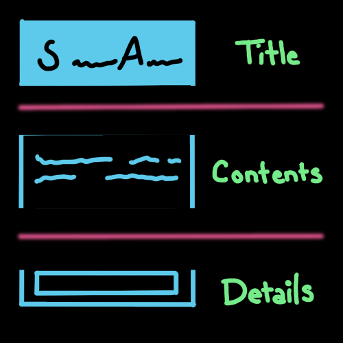
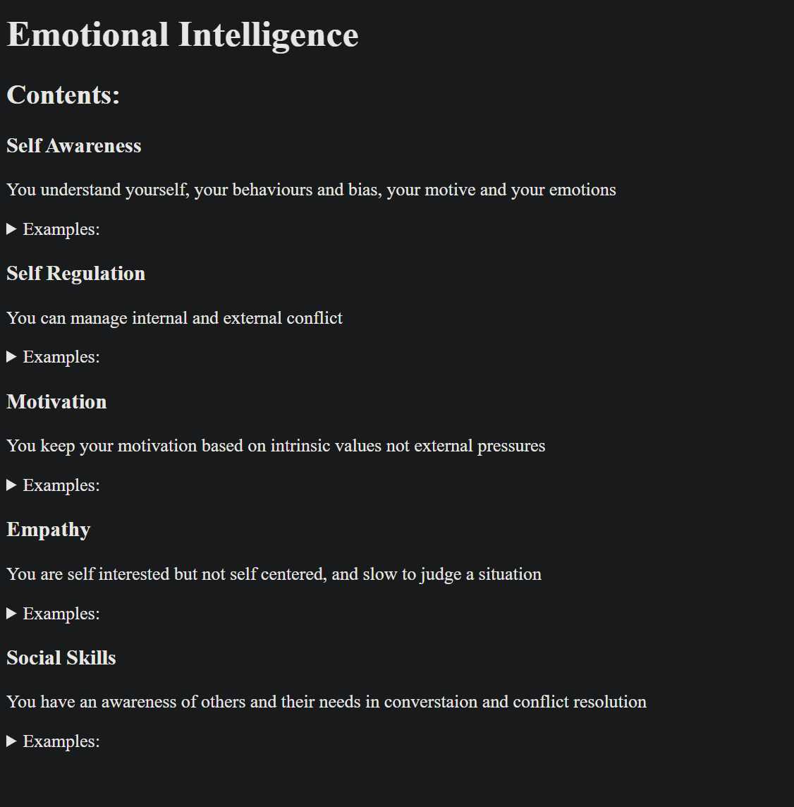
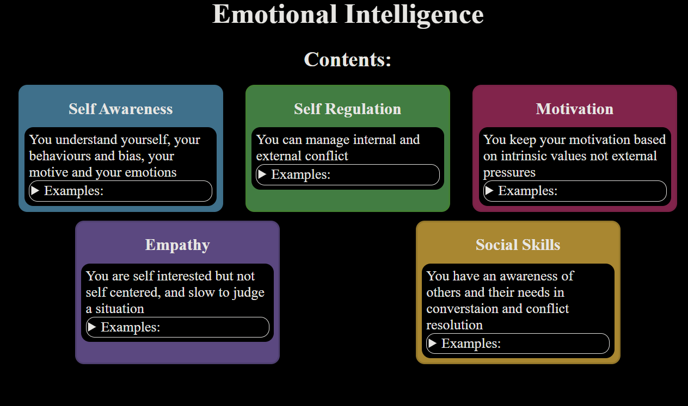
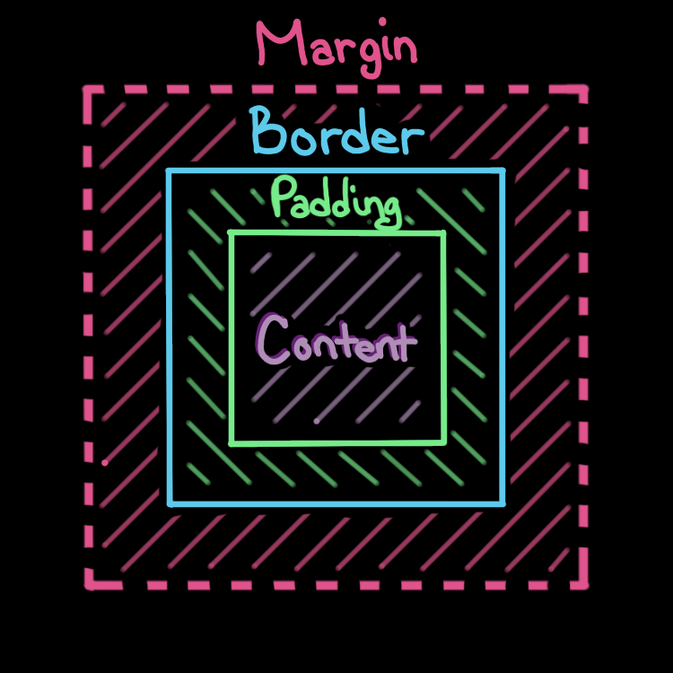
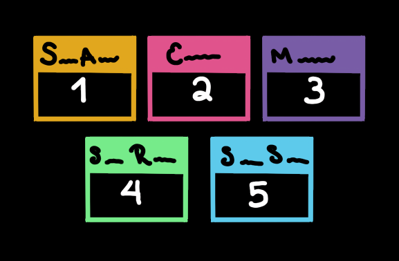
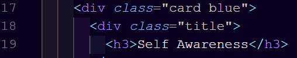

# Review

We're going over a good deal of terminology so let us review some of what we've learned so far:

**CSS Terminology**

- selector: element being selected
- declaration: set of rules for the element being selected
- properties: attribute of element selected that is being changed
- property values: value that will apply intended change for the element selected

**Common HTML Tags/Elements**

- head: contains metadata
- header: contains important static information
- body: contains the content
- main: contains the main content of the webpage.
- footer: appears at the bottom, often used for copyright, social media links, and other information.
- p: contains and displays text
- div: container for grouping displayed items
- nav: contains the links for the web site pages
- ol/ul: contains list items, ordered or unordered

**Common Commands on the Command Line Interface (Git Bash or Terminal)**

- cd
- ls
- mkdir
- rmdir
- touch
- clear

# Introduction:

We've got the pieces, and we're starting to understand how to style them, but how do they know where to go on a page, and how do we change that? That's layout, and what we're tackling next.

Also you will need Live Server to run today's assignment so please make sure you've downloaded that extension from VS Code's extension tab.

# Instructions:

To understand layout we're going to learn a bit about how CSS "sees" HTML elements while we work on our emotional intelligence. Here's a sketch of what we will be building.


## Step One: Choose your colors!

We have five cards so you need to choose five colors. There is a wide variety of places to start with that but one that has been proven again and again is [Coolors.co](https://coolors.co/). Simply click the link, and then click the "Start Generator" button on the screen. Should look something like the image below: 



Now you can lock in the colors you like by pressing the padlock, explore variations of the colors, and recycle the colors you don't want, allowing you to pick, color by color the set of colors you'd like to use. 



When you've selected your five colors, write down the hexidecimal code for each of your colors. The hexidecimal code will look something like this: `#e1a71d`.

> If you want to use the ones from the example picture above those colors are as follows: 
>  - `blue: #5ecaeb;`
>  - `green: #76eb8a;`
>  - `pink: #e0538C;`
>  - `purple: #785ca6;`
>  - `yellow: #e1a71d;`

## Step Two: Start New Project

1. Just as before, open your command line / terminal / git and navigate to your projects folder
2. Create a new directory called "emotional-intelligence"
3. Navigate to that directory and create two new files, an "index.html" file, and a "styles.css" file.  
4. Open this directory in VS Code by entering "code ." in your command line / terminal / git
5. Open the file "index.html" and initialize the file with the bang, "!", and enter, then link the HTML and CSS files in the head of the HTML file. Start up Live Server for your "index.html" page so we can keep track of the work as we go.

## Step Three: Start with the header and card container

In the "index.html" file, lets start adding our content.

6. Change the title of the page, in the head, between the `title` tags, to "Emotional Intelligence"
7. Add a `header` element, this is where we're going to put the displayed title for the page
8. Now, add an `h1` element in between the `header` tags. This `h1` should read "Emotional Intelligence". 
9. Create a `div` with the class of "card-display". This will help us to style these cards later, right now we're just grouping them together. 
10. Create a `div` inside of "card-display" with a class of "title". Make an `h3` inside the "title" and give it the content of "Components:"

## Step Four: Create your first card

So what is a card? 

Well we know it's a container, but they're pretty widely used and usually include things like a title for the card, and some information to display. The cards we're making look something like this: 



But we can break our card down further ... 



So we can see that we have two main sections to the card, the title and the contents. We also have a details section in the bottom of the contents, but to get to the details, we should probably know what we need the cards to say! Since today's focus is on Emotional Intelligence, we're going to learn about the five components of Emotional Intelligence: 
- Empathy
- Motivation
- Self-Awareness
- Self-Regulation
- Social Skills

These will be the titles of your cards. Take these components and let's head to google. Google is a person's best friend, but you must know how to use it. We'll dive deeper into Google FU but for now the basics. When doing a google search, you're going to keep it simple. Don't type out a whole question such as, "What is the concept of Empathy through the lens of Emotional Intelligence?", take the bones. What's the main concept? Emotional Intelligence. What's the sub concept, or component? Empathy. What do you need of that? A definition, or explaination. So here's what you do:

- You're going to navigate to google. 
- Type your search into the search bar following this idea: `'Concept' 'Sub-Concept' 'Need'`
So type: 

> `Emotional Intelligence Empathy Define`

and see what comes up. Take a moment with each concept to translate the definition into your own words and work together to figure out good examples of each concept. Jot down and save these for the next part.

Now let's make some cards:

11. Make a `div` inside of the "card-display" but below the "title" container, and give it a class of "card" 
12. Inside of "card" make a `div` with a class of "title". Inside "title" make an `h3`, this is where you'll put the concept that the card is for, i.e. Self-Awareness, Motivation, etc. 
13. Make a `div` below "title" inside of "card" and give it a class of "content". Inside this div make a `p` element, then add your definition of the concept here.
14. Finally, make a `details` element, and inside that make a `summary` element. Inside of the `summary` tags, write out "Examples: ", then below that make an unordered list (`ul`), and put each of your examples in a list item (`li`).

Now that's a card. And guess what, hard parts over. Select your entire "card" `div` and press `ALT` + `SHIFT` + `Down` to copy all of your work. Now you have two "card"s. Replace the second card's "title" and "contents" with the second concept, and continue until all five concepts are on your screen. 

## Step Five: STYLE! FLAIR! Pizzaz!

So how do we get from this: 



To this?



If you guessed CSS, you'd be correct, and remember those colors we chose earlier. Here's where we're going to use them.

15. Open your "styles.css" file. At the top type `:root` and open some curly brackets so we can store some values. Inside the curly brackets you will name your colors, and store their value. It'll look something like this, I'm using the values from earlier: 

```
:root {
  --blue: #5ecaeb;
  --green: #76eb8a;
  --pink: #e0538C;
  --purple: #785ca6;
  --yellow: #e1a71d;
  --border-radius: 10px;
}
```
> You will often have color palletes for websites, and you know what color you want all the text to be or all the borders. Instead of writing those instructions over and over, we can save ourselves some time (and typos) by storing those values. You can also store margins, padding, height, width, and many other values here. 

From here we work from the top down.

16. Your next selector for CSS is the aterist "*", this selector selects every element and allows for us to set some standards. Usually it's a good idea to get rid of behaviour you know you're going to change, so in this case we will set the margin and padding properties to "0", and the box-sizing property to "border-box". This ensures that we have full control over how our elements behave with our CSS without some pesky presets getting in the way. But what is "border-box" and what does it have to do with box-sizing. 

> "border-box" is based on the concept in CSS reffered to as the Box Model where every element in HTML is basically a box. The box model starts with the content box which has padding around that, and then a border. The border is considered the "edges" of the box. Then there's margin, which is the space from the edges of the box, the border, out. See below image for a visual example: 
> 
> Every HTML element is wrapped in this hidden, unmarked box. You can also build on this concept of boxes in boxes to build out entire layouts with different displays!

17. Next select the `body` and apply the following settings; `color: white;`, `height: 100vh;`, and `background: black;`. This will set our text to white, our background to black, and set our body to be the full size of our browser window. 

18. The `header` is next on our list - lets set the `width` to `100vw`, and the `padding` to `25px auto` meaning it'll have 25 px of padding on top and bottom. 

19. To make the text in the `header` centered apply `center` to the `text-align` property. 

Next, we're going to be formatting those cards, but we'll be using something new called flex. Flex is an option for display, a property that changes how an item fits in the flow as well as changing the display properties of its inner items. Flex is one of the more widely used methods for this because it allows you to dynamically display information, or rather, allows you to organize a group of information by some default rules, i.e. no more than 3 in a row, etc. 

Flex can seem complicated but [Flexbox Froggy](https://flexboxfroggy.com/) does a great job of breaking it down. We're going to use some of the basic concepts with this task but feel free to explore it more. 

20. Select the "card-display" element and set `display` to "flex". This sets up the inner elements to be displayed in any direction and allows the inner elements to chhange their size depending on the available space. You're also going to set `flex-flow` to "row wrap" which tells the element to display it's children in a row and to allow that row to wrap around to the next row. The last flex setting, for now, will be `justify-content` which we set to "center" to align the items in a balanced way. Finally, set `padding` to "10px" and we can move on to the next element. 

21. Select the "title" class, remember that this applies to every element we assigned the class "title" to, but theres a few things they all have in common. For one, they're all a title, so we want them to take up the whole first row in the way that they display. This is done by setting their `width` to "100%" of the available space. We're also going to add `margin`s of "10px auto" which will give it 10px on the top and bottom, and automatically redistribute the space on the left and right to be even. Finally, "center" the `text-align` property, and we can move onto the next element. 

22. Now we're working with the cards themselves. Select the "card" class and let's get to work. First, we'd like three to display across the first row, and two across the second. You can address this a few ways but to ensure that there is space between them we can set the `width` to "30%" since that's a little under 1/3 of the available space. We'll give it a `margin` of "5px auto" to ensure that there is space seperating them on smaller screens. Add a `padding` of "5px" to make sure the inner elements aren't wrestling with the borders of the outer elements. Now we can deal with the borders. Set `border` to "2px solid" and `border-radius` to "10px" or our variable we set in the `:root` by using `var('variable name')` as the value of the property we're trying to change. This gives us a nice edge for our cards to distinguish them from the background. 

23. Let's try something new, use the selector `.card > .title`. What does it mean? Well, we know it's using the classes "card" and "title" but what does the carrot mean? The carrot means that the element listed after is the one we're looking for and it is a child of the element listed before the carrot. Easily read as, "class card whose child is class title". This is going to specifically target elements who's class is not only "title" but who's parent element class is "card". This means the "title" for the "contents" element will not be targeted by this. All we're doing for now is setting the `color` of the text to "black". 

24. Again we're going to use the child combinator (>) and select `.card > .content` to target the content of our cards. Set `color` to "white", `padding` to "5px", and `background-color` to "black", this will help the text stand out against the color of the cards. We will also set the `border` to "0", and the `border-radius` either to "10px" or to our variable. 

We're almost there just the details and colors left. 

25. Select `.card > .content > details` and set the following: 
- `border: 1px solid;`
- `padding: 2px;`
- `border-radius: 10px` or `border-radius: var('variable name');`

26. Because I'm a stickler for details, haha, we're also goinig to add a hover effect for when your mouse hovers over the examples we set up in the details. Select `.card > .content > details:hover` and set `cursor` to "pointer", which just changes the curser from an arrow to a pointed hand, letting people know that the item is clickable. 

Now it's time for the colors. 

27. Pick which cards you'd like to be which color, and list out the colors in the order that the cards appear on the screen. Row one, first item on the left is card one, second item from left is card two, item on right is card three. Row two, item to the left is card four and item to the right is card five as seen below: 



28. Now for each color we create a class named after that color and add it to the card it applies to, for instance, the five colors above are: blue, green, pink, purple, and yellow. So go into your "index.html" file and add those class names to card so it will look like this: 



Do this for all of your cards and then go back to your "styles.css" file. Now select your first card by selecting `.card."color"`, using the above example we would write `.card.blue`. Then we have two properties we need to change, `background` and `border-color`, both are being set to our variable with that same color from our `:root` selector. It should look something like this 

```
.card.blue {
  background: var(--blue);
  border-color: var(--blue);
}
```

Highlight from the first period before "card" to the curly brace closing the declaration. Press `ALT` + `SHIFT` + `Down` to copy this code down and change the color name in the selector. Do this for all your colors.  

## Goal:

Create a web page that has: 
- Emotional Intelligence as the title of the page
- A flexed display container for cards with a heading of "Components" 
- Five cards displaying the five components of emotional intelligence
- Each card should display in a different color
- Each card should have a details element that expands to have examples of the Component displayed on the card

## Stretch Goals:
- Add hover effects to the cards themselves
- Overlap the cards in an intentional and readable way
- Use [this contrast checker](https://webaim.org/resources/contrastchecker/) to check if your lettering is accessible (contrast of 4.5/1 or greater) or not on your cards, and if it is not (contrast lower than 4.5/1)
- Make another page just like this for the different types of Body Language (hint there's five types and those types are shaped by four things)


## Grading Criteria:

- Does Not Meet Expectations: Incomplete work, not all criteria are met
- Exceed Expecations: Meets the goal & stretch goal
- Meets Expectations: Takes the project features beyond the stretch goal, Helps other students learn and succeed

## Activity Debrief:

## Quiz

## Deeper Dive:

## Next Steps:

# Recap
